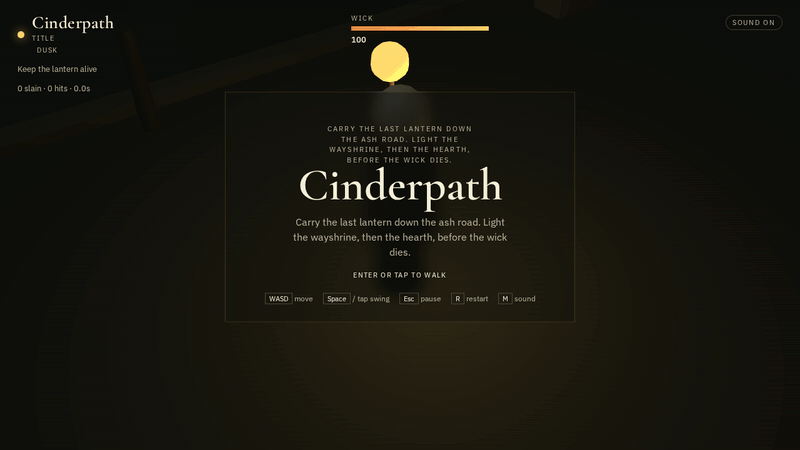
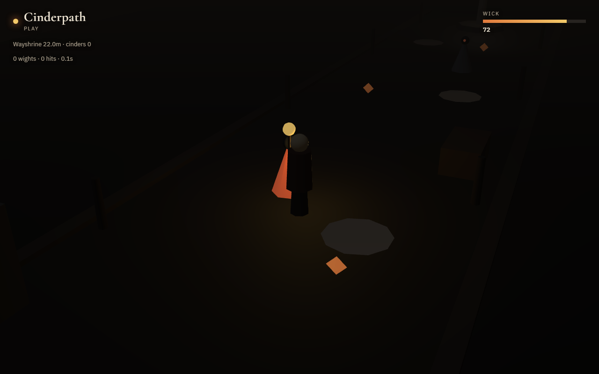
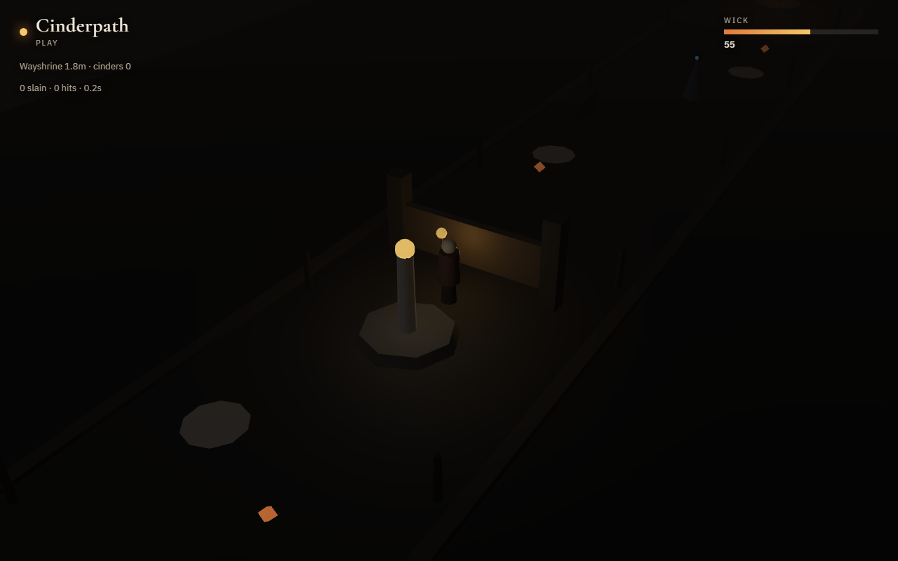
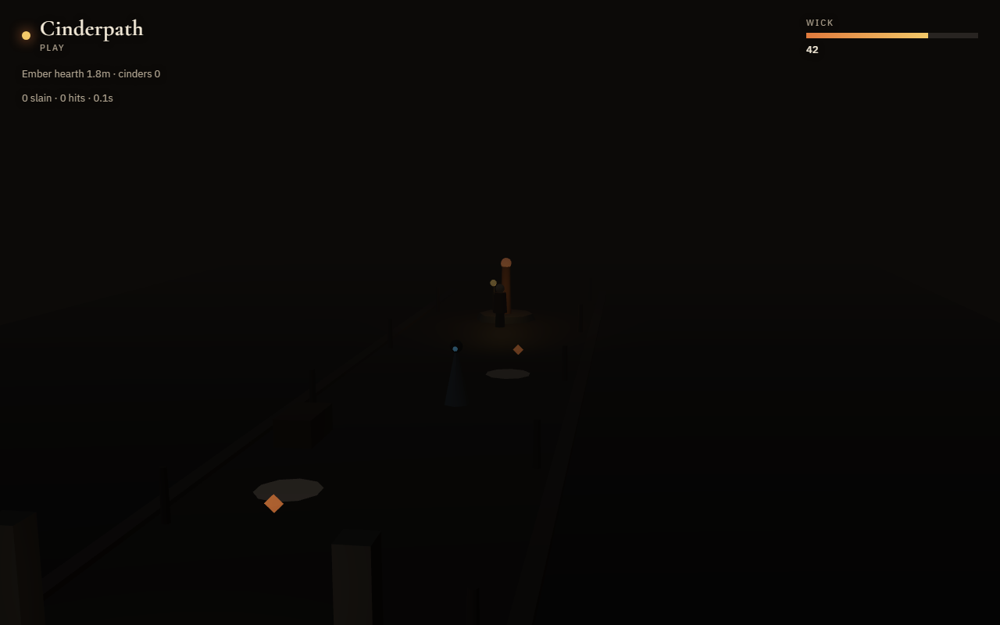

# Cinderpath

**A small 3D action game that runs in your browser, built with JavaScript and three.js. The game logic is a deterministic simulation, checked by 70 automated tests on every push.**

[](https://github.com/idgafgreg/cinderpath/actions/workflows/test.yml)

### ▶ [Play Cinderpath in your browser](https://idgafgreg.github.io/cinderpath/)



You are the last wickwarden. The road is being eaten by ash. Your lantern is your life. Walk the flat path, spend wick to swing, step out of a wight's telegraph, light the wayshrine to open the gate, keep range on the snuffer, and put the fire on the ember hearth.

**Controls:** WASD move · Space / click swing · Esc pause · R restart · M sound on/off

## What's worth looking at

- **Game logic and graphics are separate.** `game/src/sim.js` is a deterministic simulation: the same seed and the same inputs always produce the same result. The renderer only draws what the simulation reports; it isn't allowed to decide hits, pickups, or fuel.
- **Combat is a state machine.** Every attack has startup, active and recovery windows (see the timing table in [`DESIGN.md`](DESIGN.md)). A hit only lands during the active window, once per swing and target.
- **Every scenario is reachable by URL.** `?fixture=combat`, `?fixture=snuffer`, `?fixture=hearth` and others drop you straight into a specific moment of the game, which makes bugs easy to reproduce.
- **70 automated checks run on every push.** 49 unit tests cover the simulation, save/load and audio. Another 21 checks replay each fixture through the real simulation, headless, and assert what happened: *"closed gate holds the player"*, *"snuffer steps back to keep range"*, *"lantern out loses"*.

## Screenshots

| Combat | Gate | Ember hearth |
| --- | --- | --- |
|  |  |  |

## Run it locally

Tested on Node 22 (the version CI uses).

```bash
npm test                     # 49 unit tests + 21 fixture checks
npx --yes serve -l 4173 .    # then open http://localhost:4173/
```

Jump to a specific scenario:

`/?fixture=combat` · `/?fixture=lowfuel` · `/?fixture=shrine` · `/?fixture=gate` · `/?fixture=snuffer` · `/?fixture=hearth` · `/?fixture=blocker` · `/?fixture=oil` · `/?debug=1&seed=7`

## How it's built

```
game/content/catalog.js   immutable content: player, enemies, zone, fixtures
game/src/sim.js           deterministic runtime: stances, contact, win/lose
game/src/input.js         edge-triggered commands
game/src/audio.js         quiet synthesized mix driven by sim events
game/src/render.js        low-poly three.js placeholders driven by sim events
game/tests/               unit tests + headless fixture walk
```

No build step and no framework: plain ES modules, three.js loaded from a CDN, and GitHub Actions running `npm test` on every push and pull request.

## Built with AI agents, on a written process

I built Cinderpath with AI coding agents working from written procedures in [`agent-skills/`](agent-skills/README.md), one file per kind of change (vertical slice, combat verbs, enemy content, testing, release), and a hard rule that nothing counts as playable until `npm test` passes.

The approach is adapted from [MengTo/Skills](https://github.com/MengTo/Skills), a public MIT library of agent procedures for playable web games. Nothing in `agent-skills/` is copied from it; the skills, fiction, content and simulation here are original.

## License

MIT. See [`LICENSE`](LICENSE). Methodological debt to [MengTo/Skills](https://github.com/MengTo/Skills) is gratefully noted; their copyright remains theirs.
