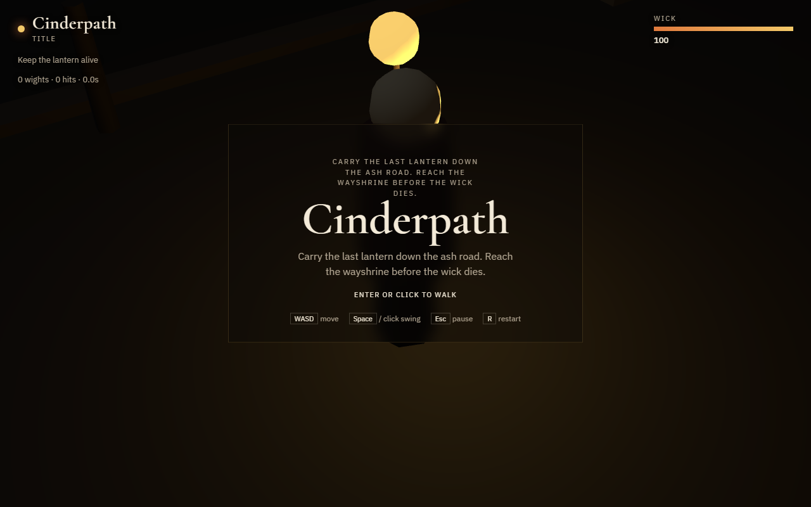

# Cinderpath

An original lantern-road action slice and the agent skills used to build it.



You are the last wickwarden. The road is being eaten by ash. Your lantern is your life. Walk the flat path, spend wick to swing, step out of a wight's telegraph, light the wayshrine to open the gate, keep range on the snuffer, and put the fire on the ember hearth.

**Play:** [idgafgreg.github.io/cinderpath](https://idgafgreg.github.io/cinderpath/)

Play locally:

```bash
npm test
npx --yes serve -l 4173 .
```

Then open http://localhost:4173/

Review states:

- `/?fixture=combat`
- `/?fixture=lowfuel`
- `/?fixture=shrine`
- `/?fixture=gate`
- `/?fixture=snuffer`
- `/?fixture=hearth`
- `/?fixture=blocker`
- `/?fixture=oil`
- `/?debug=1&seed=7`

Controls: **WASD** move · **Space / click** swing · **Esc** pause · **R** restart

## Why this repo exists

[MengTo/Skills](https://github.com/MengTo/Skills) is a public MIT library of agent operating procedures for design and playable web games. We studied that library — the folder contract, "prompts are assets", "specs beat vibes", vertical slices, data-versus-runtime, combat clocks, and fixture-backed QA — then wrote **our own** skills and **our own** game.

Nothing in `agent-skills/` is a copy of Meng To's files. The methods are adapted. The fiction, catalog, and simulation are original.

This is not Hollowmere. Cinderpath has no farm, parish, villagers, or Unity pipeline — different fiction, different repo, different game.

## Skills

Load the narrowest matching file before editing the game:

| Need | Skill |
| --- | --- |
| One playable loop | [`build-vertical-slice`](agent-skills/build-vertical-slice/SKILL.md) |
| Route, collision, lights | [`author-flat-world`](agent-skills/author-flat-world/SKILL.md) |
| Attack timing | [`design-combat-verbs`](agent-skills/design-combat-verbs/SKILL.md) |
| New enemy as data | [`define-enemy-content`](agent-skills/define-enemy-content/SKILL.md) |
| Wick economy | [`keep-lantern-loop`](agent-skills/keep-lantern-loop/SKILL.md) |
| Proof | [`test-playable-slice`](agent-skills/test-playable-slice/SKILL.md) |
| Make / judge loop | [`iterate-until-playable`](agent-skills/iterate-until-playable/SKILL.md) |
| Release | [`ship-web-game`](agent-skills/ship-web-game/SKILL.md) |

## Architecture

```
catalog.js   immutable content (player, enemies, zone, fixtures)
sim.js       deterministic runtime (stances, contact, win/lose)
input.js     edge-triggered commands
render.js    honest low-poly placeholders driven by sim events
```

Combat is a state machine. Hits come from wedge contact during an `active` window, once per action and target. Meshes do not decide damage.

## Next slices

Only after this road stays green:

1. Authored encounter waves on the second road
2. A short directed ending after the hearth
3. A quieter mix: distinct slam / spit / oil cues
4. Ash motes that thicken only in ashnight, still not a meter

## License

MIT. See `LICENSE`.
Methodological debt to [MengTo/Skills](https://github.com/MengTo/Skills) is gratefully noted; their copyright remains theirs.
