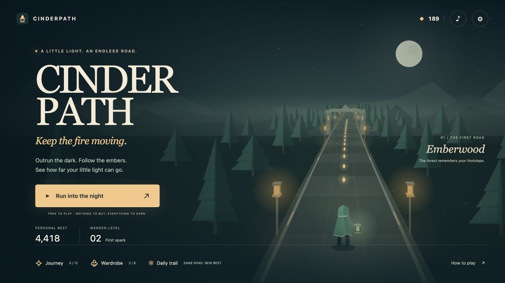

# Cinderpath

**A little light. An endless road.**

An atmospheric endless runner for phones and desktop browsers. Carry a lantern through Emberwood, the Sunken Sanctum, and Golden Reach. Dodge stones, jump roots, slide beneath gates, and chase a new personal best. Every unlock is earned through play: no ads, purchases, loot boxes, or account requirement in the game.



## Play

[Play Cinderpath](https://cinderpath.alesnargregory.chatgpt.site) · public web demo.

With Node.js 22 or later:

```sh
npm start
# http://localhost:4173
```

No dependency installation is needed. To produce and serve the deployment bundle:

```sh
npm test
npm run build
npm run preview
```

The game is an installable PWA: use your browser’s Install App command, or Share → Add to Home Screen on iPhone. Runner assets work offline after the first full load. HTTPS or localhost is required for installation and service workers. Saves stay on the current browser/device.

## Controls

| Action | Phone | Keyboard |
| --- | --- | --- |
| Change lanes | Swipe left / right or tap arrows | Left / Right or A / D |
| Jump roots | Swipe up or tap ↑ | Up, W, or Space |
| Slide under gates | Swipe down or tap ↓ | Down or S |
| Pause | Pause button | Escape |
| Sound | Sound button on home / Settings | M during play |

Hits drain your lantern. Green oil refills it. Violet magnets gather cinders from other lanes; blue wards block a hit. Collect 24 cinders without a damaging hit to trigger Ember Rush. Pause → Finish & bank ends a run while keeping earned rewards.

## Built to come back to

- Three cycling environments and seeded, progressively faster obstacle patterns.
- Collection combos, seven-second Ember Rush, and instant retries.
- Warden XP, twelve automatic journey milestones, six cosmetic cloaks, and nine earnable craft levels.
- A daily UTC-seeded trail with equal base stats, unlimited attempts, and a local best.
- A synthesized soundtrack, responsive layouts, touch controls, reduced atmospheric motion, and a low-cost render mode.

## Engineering

The runner uses vanilla ES modules and a custom Canvas 2D perspective renderer. It keeps the simulation separate from presentation, runs gameplay at a fixed 60 Hz, checks swept collision at the crossing position, generates reachable escape routes, and settles run rewards once. There is no runtime framework, external font, remote image, payment service, or analytics dependency.

| Module | Responsibility |
| --- | --- |
| `runner/content.js` | Frozen rules, environments, cosmetics, crafts, milestones |
| `runner/sim.js` | Seeded patterns, timed actions, collisions, fuel, scoring |
| `runner/profile.js` | Save normalization, progression, atomic run settlement |
| `runner/render.js` | Bounded procedural scenery, character pose, effects |
| `runner/main.js` | Input, fixed-step loop, accessible menus, lifecycle |
| `runner/audio.js` | Gesture-started synthesized soundtrack and event cues |
| `sw.js`, `scripts/build.mjs` | Offline shell and reproducible static build |

`npm test` runs **80 tests and 21 classic fixture checks**, including a 100,000-row fairness check and a damage-free 5 km simulated run. These establish mechanical correctness, not user retention or physical-device performance. See [QA notes](docs/QA.md), [design](DESIGN.md), and [portfolio kit](docs/PORTFOLIO.md).

Debug a repeatable run with `/?seed=7&debug=1`. The debug output shows real simulation state; it does not grant rewards or invulnerability.

## Original prototype

The original isometric lantern-combat game is preserved at `classic.html`. Its eight `?fixture=` routes, checkpoints, and winning ghosts still work. Old root `?fixture=` links redirect there. Classic mode retains its original Three.js CDN and Google Fonts dependencies and is not included in the offline shell.

Original design: [classic-design.md](docs/classic-design.md). Original agent procedures: [agent-skills](agent-skills/README.md). Those procedures were independently written after studying the methodology of [MengTo/Skills](https://github.com/MengTo/Skills); no foreign skill files or game assets were imported. Cinderpath has its own fiction and art.

## Deployment and license

`dist/` can be hosted on a static HTTPS host. The included Pages workflow builds and uploads the site when manually dispatched; GitHub Pages must first be configured to use GitHub Actions. Sites hosting is associated through `.openai/hosting.json`; publish only the tested committed source.

MIT. See [LICENSE](LICENSE). The procedural artwork, UI, and synthesized runner music are included in this repository. Temple Run and Subway Surfers are design references, not asset sources or affiliations.
